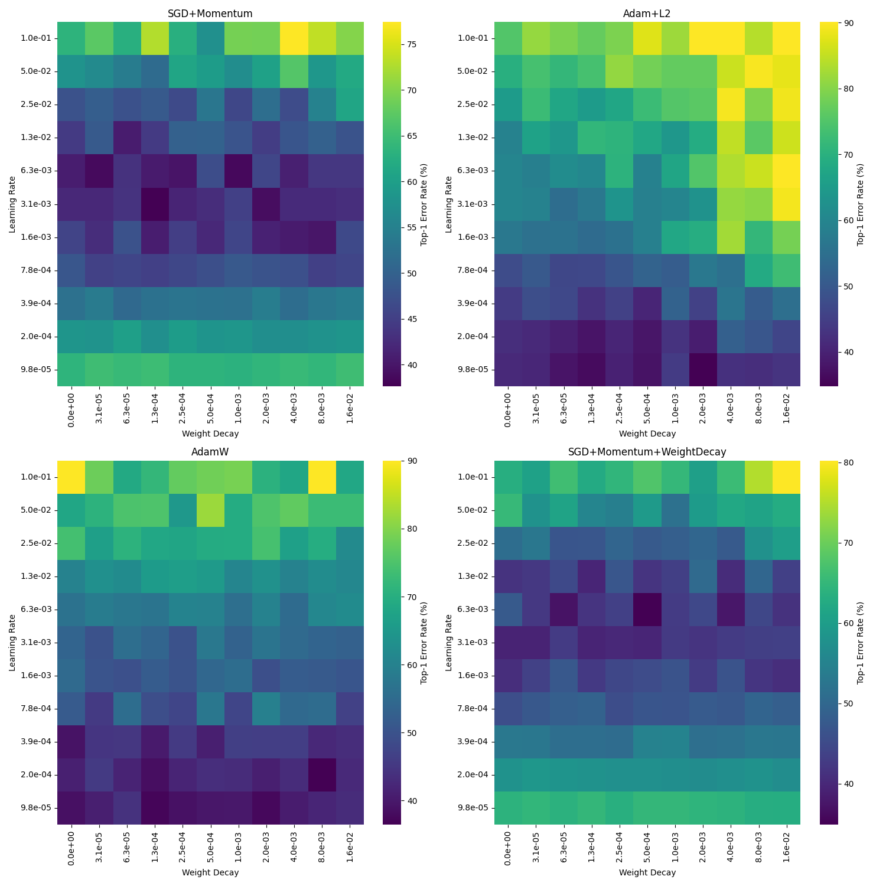

# experiments

## Proving CUDA is Turing complete
GPUs are Turing complete. So is CUDA, as a general GPU programming language. Let's simulate a Turing universal machine in CUDA:

To compile `turing_machine.cu`:
```bash
nvcc -o turing_machine turing_machine.cu
```

If you want to simulate this in a Colab instance you can add the line `%%writefile turing_machine.cu` at the beginning of the cell to write the file to directory and use the special escape symbol `!` to execute cells as bash.

## Comparing L2 and weight decay in SGD with momentum and Adam

Poor attempt at reproducing [AdamW paper](https://arxiv.org/pdf/1711.05101)

ResNet trained for 1 epoch on CIFAR-10:



Intended to reproduce figure 2 of the paper. Note that in the paper they train for 100 epochs. However I thought it wisely to stick to a single epoch. Many wrong results in optimization theory were reached because of overfitting through hundreds of epochs.